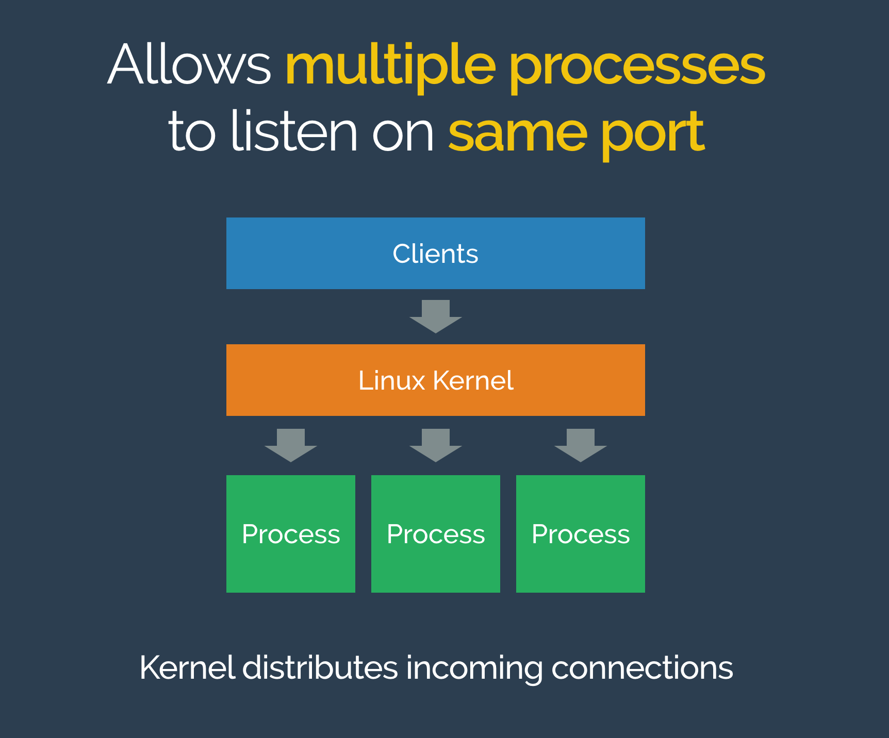

Linux port sharding demo
========================

Demo showing how to use the `SO_REUSEPORT` linux socket option, allowing multiple processes to listen on the same TCP or UDP port.

Example available in Ruby and Python (both do the same thing):
- [server.py](root/src/server.py)
- [server.rb](root/src/server.rb)

What is this?
-------------

See my really quick [Linux Port Sharding](https://speakerdeck.com/joewalnes/linux-port-sharding) walkthrough first.

Setup
-----

- If you're on Linux with kernel 3.9 or later (check with `uname -v`), you can just run the Python or Ruby scripts directly.
- If you're on Mac OSX, fret not, install Docker and run `make`, which will install a working Docker image and drop you into a ready to go tmux session, where you can call the scripts.

Usage
-----

Run the server, it listens on port 1234. Connect to it with netcat or telnet to see it do something: `nc localhost 1234`.

Now run another server process, and a few more. You'll see the kernel allows these all to listen on the *same* port.

Connect to the port. You'll see the kernel picks one of the processes and allows it to handle it. Next time it may be another process.

You can add and remove processes. You can even run both the Python and Ruby processes at the same time and the kernel will share the workload. However, note that queued connections which have not been accepted will be lost when stopping a process.

More
----

* [The SO_REUSEPORT socket option](https://lwn.net/Articles/542629/)
* [Using SO_REUSEPORT with Python](http://www.giantflyingsaucer.com/blog/?p=4684)
